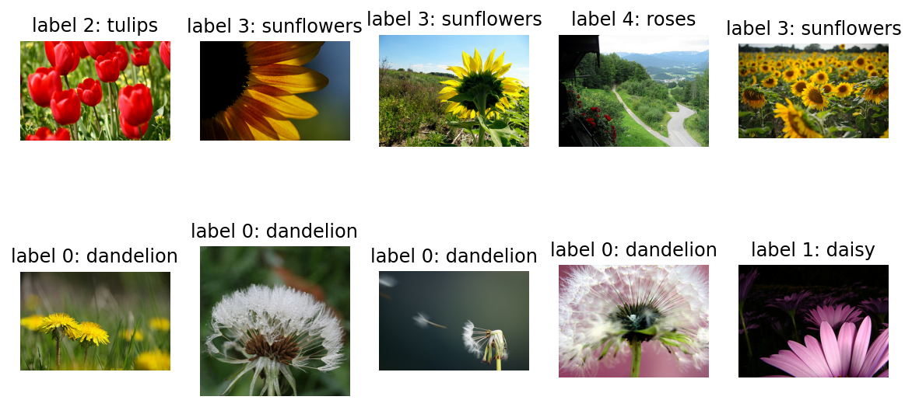
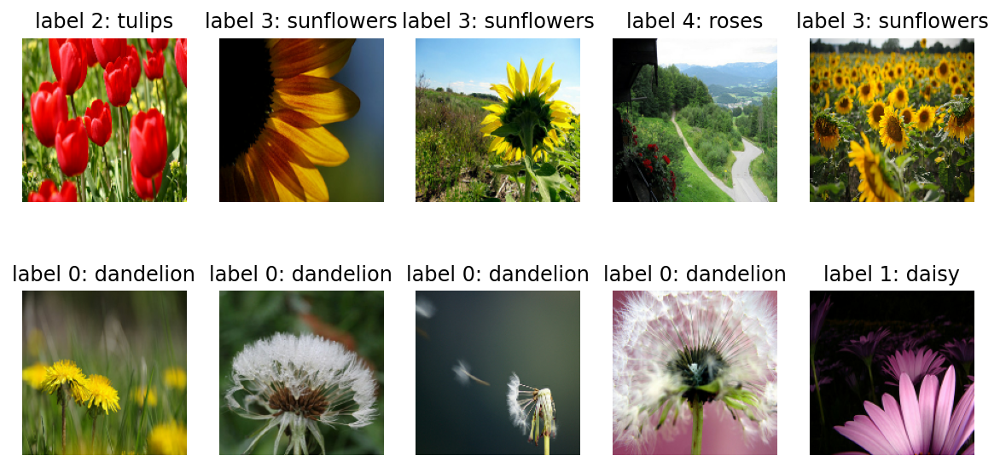
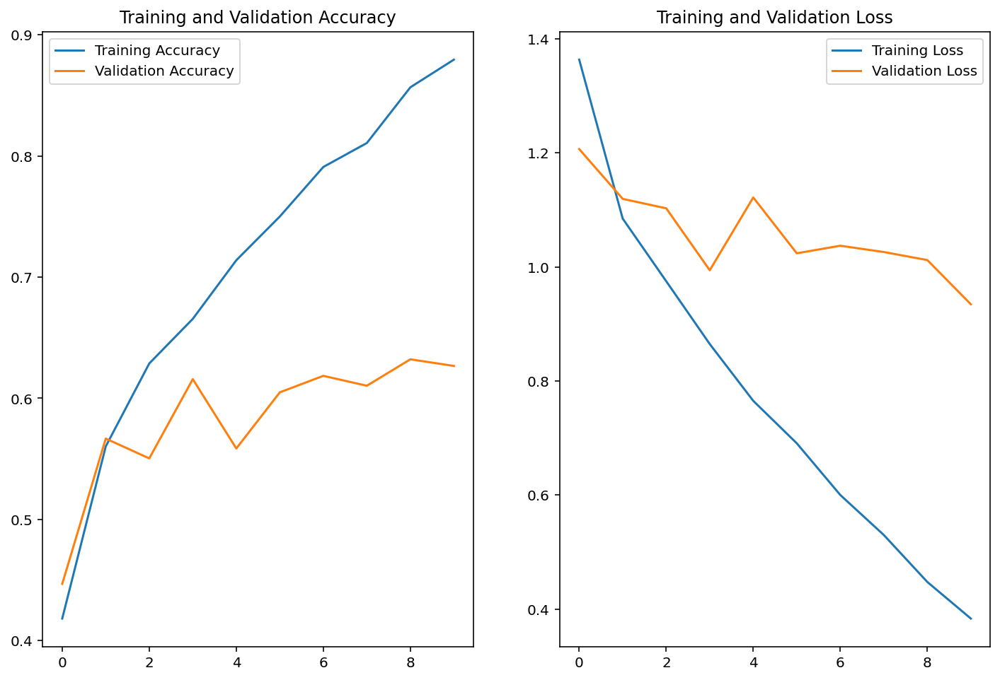
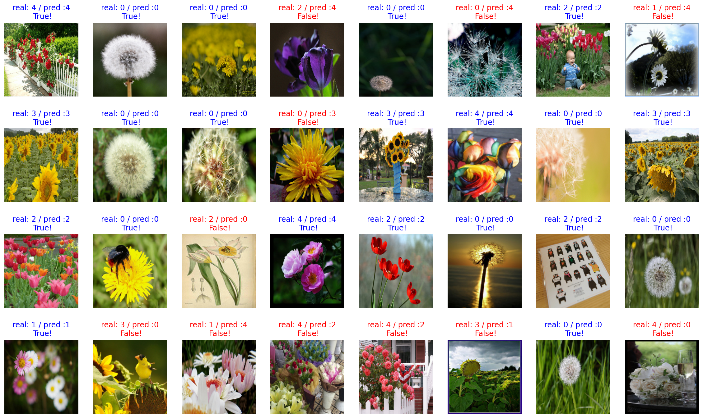
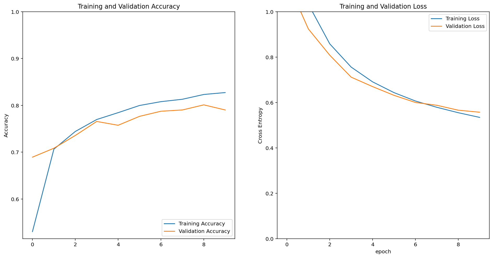
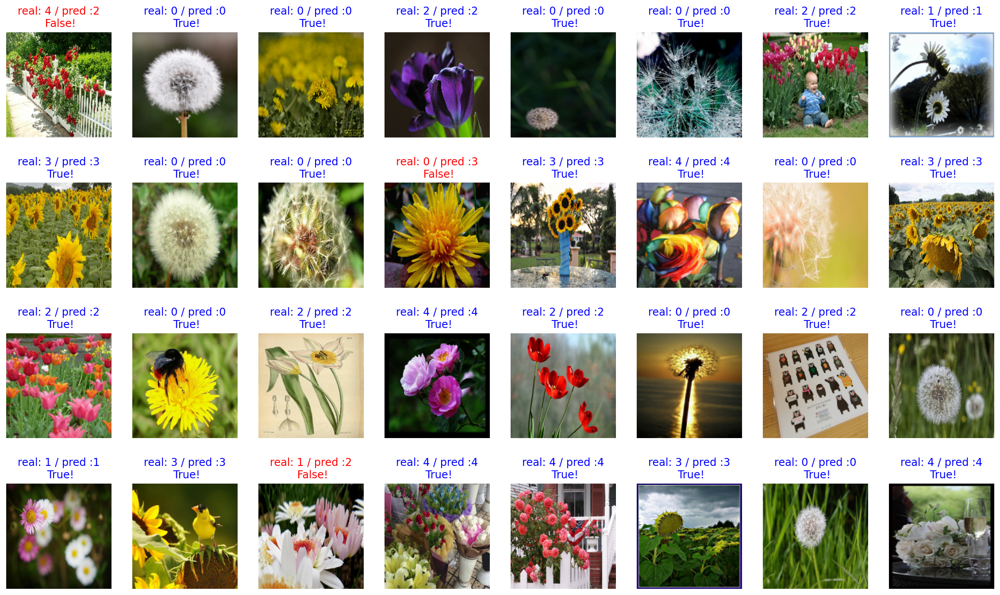
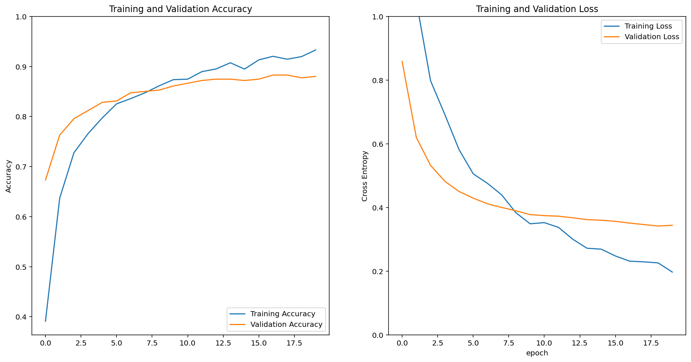
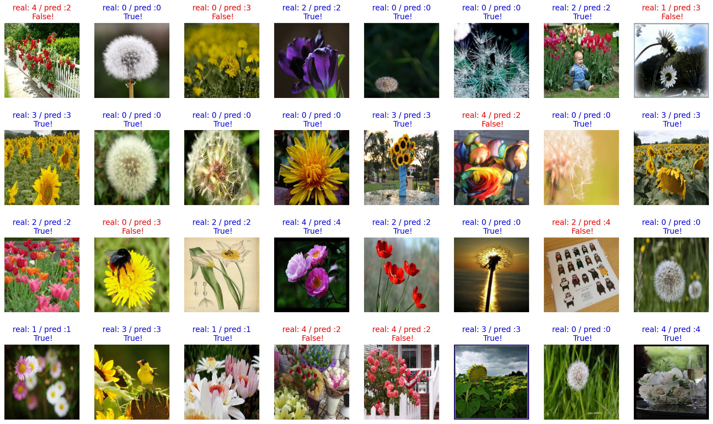
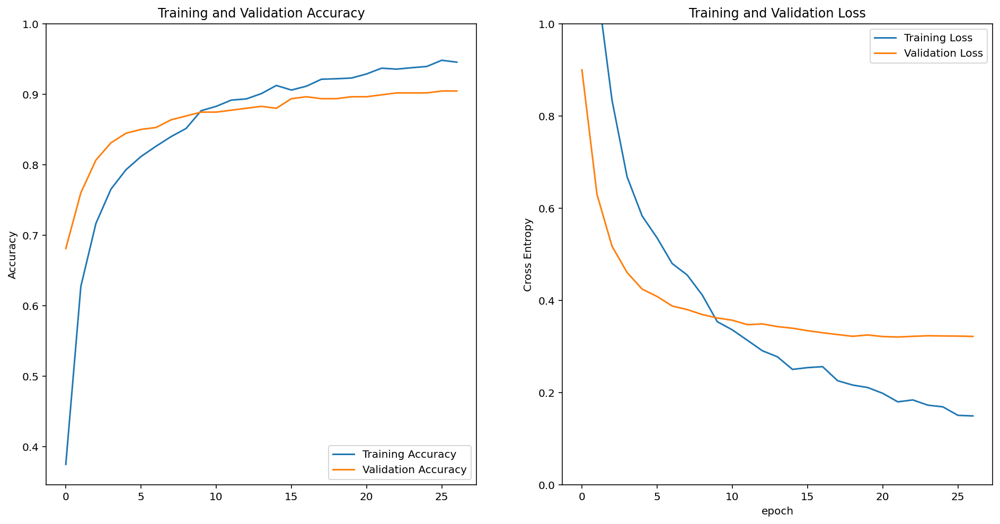

# 목차
## 1. 데이터셋 내려받기
## 2. 데이터셋을 모델에 넣을 수 있는 형태로 준비하기
## 3. 모델 직접 설계하기

### 3-1. 모델 설계하기
### 3-2. 모델 학습시키기
### 3-3. 모델 성능 평가하기

## 4. 사전학습 모델 사용하기

### 4-1. VGG16
```
4-1-1. 모델 설계하기
4-1-2. 모델 학습시키기
4-1-3. 모델 성능 평가하기
```
### 4-2. MobileNetV2
```
4-2-1. 모델 설계하기
4-2-2. 모델 학습시키기
4-2-3. 모델 성능 평가하기
```
## 5. 모델 활용하기


```python
# 경고메시지 삭제
import warnings
warnings.filterwarnings("ignore")

import tensorflow_datasets as tfds
```

# 1. 데이터셋 내려받기


```python
import tensorflow_datasets as tfds

# tf_flowers 데이터셋 로드
# train_data, validation_data, test_data 나누기
(raw_train, raw_validation, raw_test), metadata = tfds.load(
    name='tf_flowers',  
    split=['train[:80%]', 'train[80%:90%]', 'train[90%:]'],
    data_dir='~/aiffel/tf_flowers/',
    download=True,
    with_info=True,
    as_supervised=True,
)

print("데이터셋 다운로드 완료!")
```

    데이터셋 다운로드 완료!


```python
import collections

# 클래스 이름 가져오기
class_names = metadata.features['label'].names
print("클래스 이름:", class_names)

# 클래스별 이미지 개수 계산
label_counts = collections.Counter()
for image, label in raw_train.concatenate(raw_validation).concatenate(raw_test):
    label_counts[int(label.numpy())] += 1

# 클래스별 이미지 개수 출력
for idx, count in sorted(label_counts.items()):
    print(f"{class_names[idx]}: {count} 개")
```

    클래스 이름: ['dandelion', 'daisy', 'tulips', 'sunflowers', 'roses']
    dandelion: 898 개
    daisy: 633 개
    tulips: 799 개
    sunflowers: 699 개
    roses: 641 개


```python
# 필요한 라이브러리 불러오기
import tensorflow as tf
import matplotlib.pyplot as plt
%matplotlib inline
%config InlineBackend.figure_format = 'retina'
```


```python
# raw_train 데이터 확인
plt.figure(figsize=(10, 5))

get_label_name = metadata.features['label'].int2str

for idx, (image, label) in enumerate(raw_train.take(10)):  # 10개의 데이터 가져오기
    plt.subplot(2, 5, idx+1)
    plt.imshow(image)
    plt.title(f'label {label}: {get_label_name(label)}')
    plt.axis('off')
```


    

    


# 2. 데이터셋을 모델에 넣을 수 있는 형태로 준비하기


```python
IMG_SIZE = 160 # 이미지 사이즈를 160x160 픽셀로 통일시키기

def format_example(image, label):
    image = tf.cast(image, tf.float32) 
    image = (image/127.5) - 1 # 픽셀값의 scale 수정
    image = tf.image.resize(image, (IMG_SIZE, IMG_SIZE))
    return image, label
```


```python
train = raw_train.map(format_example)
validation = raw_validation.map(format_example)
test = raw_test.map(format_example)

print(train)
print(validation)
print(test)
```

    <MapDataset shapes: ((160, 160, 3), ()), types: (tf.float32, tf.int64)>
    <MapDataset shapes: ((160, 160, 3), ()), types: (tf.float32, tf.int64)>
    <MapDataset shapes: ((160, 160, 3), ()), types: (tf.float32, tf.int64)>


```python
plt.figure(figsize=(10, 5))


get_label_name = metadata.features['label'].int2str

for idx, (image, label) in enumerate(train.take(10)):
    plt.subplot(2, 5, idx+1)
    image = (image + 1) / 2
    plt.imshow(image)
    plt.title(f'label {label}: {get_label_name(label)}')
    plt.axis('off')
```


    

    


# 3. 모델 직접 설계하기

## 3-1. 모델 설계하기


```python
# 모델 생성에 필요한 함수 가져오기
from tensorflow.keras.models import Sequential
from tensorflow.keras.layers import Dense, Conv2D, Flatten, MaxPooling2D

import numpy as np
```


```python
model = Sequential([
    Conv2D(filters=16, kernel_size=3, padding='same', activation='relu', input_shape=(160, 160, 3)),
    MaxPooling2D(),
    Conv2D(filters=32, kernel_size=3, padding='same', activation='relu'),
    MaxPooling2D(),
    Conv2D(filters=64, kernel_size=3, padding='same', activation='relu'),
    MaxPooling2D(),
    Flatten(),
    Dense(units=512, activation='relu'),
    Dense(units=5, activation='softmax') # 5개의 클래스
])
```


```python
model.summary()
```

    Model: "sequential"
    _________________________________________________________________
    Layer (type)                 Output Shape              Param #   
    =================================================================
    conv2d (Conv2D)              (None, 160, 160, 16)      448       
    _________________________________________________________________
    max_pooling2d (MaxPooling2D) (None, 80, 80, 16)        0         
    _________________________________________________________________
    conv2d_1 (Conv2D)            (None, 80, 80, 32)        4640      
    _________________________________________________________________
    max_pooling2d_1 (MaxPooling2 (None, 40, 40, 32)        0         
    _________________________________________________________________
    conv2d_2 (Conv2D)            (None, 40, 40, 64)        18496     
    _________________________________________________________________
    max_pooling2d_2 (MaxPooling2 (None, 20, 20, 64)        0         
    _________________________________________________________________
    flatten (Flatten)            (None, 25600)             0         
    _________________________________________________________________
    dense (Dense)                (None, 512)               13107712  
    _________________________________________________________________
    dense_1 (Dense)              (None, 5)                 2565      
    =================================================================
    Total params: 13,133,861
    Trainable params: 13,133,861
    Non-trainable params: 0
    _________________________________________________________________


## 3-2. 모델 학습시키기


```python
# 모델 compile
learning_rate = 0.0001
model.compile(optimizer=tf.keras.optimizers.RMSprop(learning_rate=learning_rate),
              loss=tf.keras.losses.sparse_categorical_crossentropy,
              metrics=['accuracy'])
```


```python
BATCH_SIZE = 32 # 전체 데이터 중 32개를 랜덤으로 제공
SHUFFLE_BUFFER_SIZE = 1000

train_batches = train.shuffle(SHUFFLE_BUFFER_SIZE).batch(BATCH_SIZE)
validation_batches = validation.batch(BATCH_SIZE)
test_batches = test.batch(BATCH_SIZE)
```


```python
# 초기 모델 성능
validation_steps = 20
loss0, accuracy0 = model.evaluate(validation_batches, steps=validation_steps)

print("initial loss: {:.2f}".format(loss0))
print("initial accuracy: {:.2f}".format(accuracy0))
```

    12/20 [=================>............] - ETA: 0s - loss: 1.6374 - accuracy: 0.2398WARNING:tensorflow:Your input ran out of data; interrupting training. Make sure that your dataset or generator can generate at least `steps_per_epoch * epochs` batches (in this case, 20 batches). You may need to use the repeat() function when building your dataset.


    WARNING:tensorflow:Your input ran out of data; interrupting training. Make sure that your dataset or generator can generate at least `steps_per_epoch * epochs` batches (in this case, 20 batches). You may need to use the repeat() function when building your dataset.


    20/20 [==============================] - 20s 63ms/step - loss: 1.6374 - accuracy: 0.2398
    initial loss: 1.64
    initial accuracy: 0.24


```python
# 학습 실행
EPOCHS = 10
history = model.fit(train_batches,
                    epochs=EPOCHS,
                    validation_data=validation_batches)
```

    Epoch 1/10
    92/92 [==============================] - 5s 31ms/step - loss: 1.3633 - accuracy: 0.4183 - val_loss: 1.2065 - val_accuracy: 0.4469
    Epoch 2/10
    92/92 [==============================] - 3s 28ms/step - loss: 1.0846 - accuracy: 0.5603 - val_loss: 1.1193 - val_accuracy: 0.5668
    Epoch 3/10
    92/92 [==============================] - 3s 28ms/step - loss: 0.9748 - accuracy: 0.6287 - val_loss: 1.1027 - val_accuracy: 0.5504
    Epoch 4/10
    92/92 [==============================] - 3s 29ms/step - loss: 0.8648 - accuracy: 0.6655 - val_loss: 0.9941 - val_accuracy: 0.6158
    Epoch 5/10
    92/92 [==============================] - 3s 29ms/step - loss: 0.7652 - accuracy: 0.7139 - val_loss: 1.1218 - val_accuracy: 0.5586
    Epoch 6/10
    92/92 [==============================] - 3s 29ms/step - loss: 0.6908 - accuracy: 0.7500 - val_loss: 1.0239 - val_accuracy: 0.6049
    Epoch 7/10
    92/92 [==============================] - 3s 28ms/step - loss: 0.6002 - accuracy: 0.7909 - val_loss: 1.0371 - val_accuracy: 0.6185
    Epoch 8/10
    92/92 [==============================] - 3s 28ms/step - loss: 0.5300 - accuracy: 0.8106 - val_loss: 1.0261 - val_accuracy: 0.6104
    Epoch 9/10
    92/92 [==============================] - 3s 28ms/step - loss: 0.4477 - accuracy: 0.8566 - val_loss: 1.0120 - val_accuracy: 0.6322
    Epoch 10/10
    92/92 [==============================] - 3s 29ms/step - loss: 0.3835 - accuracy: 0.8794 - val_loss: 0.9345 - val_accuracy: 0.6267


## 3-3. 모델 성능 평가하기


```python
# 결과 그래프 출력
acc = history.history['accuracy']
val_acc = history.history['val_accuracy']

loss=history.history['loss']
val_loss=history.history['val_loss']

epochs_range = range(EPOCHS)

plt.figure(figsize=(12, 8))
plt.subplot(1, 2, 1)
plt.plot(epochs_range, acc, label='Training Accuracy')
plt.plot(epochs_range, val_acc, label='Validation Accuracy')
plt.legend()
plt.title('Training and Validation Accuracy')

plt.subplot(1, 2, 2)
plt.plot(epochs_range, loss, label='Training Loss')
plt.plot(epochs_range, val_loss, label='Validation Loss')
plt.legend()
plt.title('Training and Validation Loss')
plt.show()
```


    

    


```python
# 모델의 예측 결과 확인
for image_batch, label_batch in test_batches.take(1):
    images = image_batch
    labels = label_batch
    predictions = model.predict(image_batch)
    break

predictions
```


    array([[8.2965492e-04, 3.0842198e-03, 2.5134903e-01, 5.5691026e-02,
            6.8904608e-01],
           [7.8560549e-01, 2.1120600e-01, 1.5900509e-03, 1.7214066e-05,
            1.5813254e-03],
           [6.8786365e-01, 5.5337455e-02, 1.8471481e-01, 6.8955012e-02,
            3.1291482e-03],
           [2.0570768e-01, 2.3506443e-01, 2.7319172e-01, 5.6860675e-03,
            2.8035009e-01],
           [8.1111729e-01, 8.8608086e-02, 1.9719128e-02, 6.2137987e-03,
            7.4341819e-02],
           [2.6966792e-01, 8.1843734e-02, 2.4133112e-02, 1.8782696e-03,
            6.2247699e-01],
           [1.3376295e-03, 7.5955771e-02, 8.4033895e-01, 3.3199997e-03,
            7.9047598e-02],
           [4.7489129e-02, 2.0238563e-01, 1.5524699e-01, 8.8099696e-02,
            5.0677854e-01],
           [1.4987324e-02, 5.2783707e-05, 8.8362619e-03, 9.7600353e-01,
            1.2003377e-04],
           [9.6811646e-01, 2.8097136e-02, 5.0422462e-04, 3.1246633e-05,
            3.2509135e-03],
           [9.5352852e-01, 1.6400201e-02, 3.7396732e-03, 5.4419006e-04,
            2.5787394e-02],
           [1.3318416e-01, 3.5764236e-02, 2.1824333e-01, 5.4766595e-01,
            6.5142415e-02],
           [1.8307505e-03, 4.8119057e-02, 1.5905711e-01, 6.7814857e-01,
            1.1284453e-01],
           [2.7036793e-03, 4.3028928e-02, 2.8362834e-01, 3.6060733e-03,
            6.6703296e-01],
           [5.6169897e-01, 6.9533721e-02, 1.2522800e-01, 5.9387125e-03,
            2.3760061e-01],
           [3.3798506e-03, 1.2526212e-04, 1.8929215e-02, 9.7714955e-01,
            4.1609048e-04],
           [3.2188840e-05, 2.1797961e-04, 9.7536558e-01, 6.1455456e-04,
            2.3769781e-02],
           [8.5492194e-01, 5.0633806e-03, 1.0689602e-02, 1.2868159e-01,
            6.4337446e-04],
           [5.0114733e-01, 1.7547393e-01, 1.1282590e-01, 4.0253149e-03,
            2.0652750e-01],
           [1.7505514e-02, 1.3570353e-02, 2.5406167e-01, 8.8754852e-05,
            7.1477365e-01],
           [6.0258276e-04, 7.3724729e-04, 9.4731492e-01, 3.2963142e-02,
            1.8382182e-02],
           [7.2574812e-01, 2.5517267e-01, 6.1010579e-03, 3.1504619e-03,
            9.8277982e-03],
           [5.1034023e-03, 3.8986000e-01, 5.5443364e-01, 1.9950361e-03,
            4.8607919e-02],
           [6.1961186e-01, 3.0476013e-01, 3.0403432e-02, 2.3142563e-03,
            4.2910244e-02],
           [3.2283759e-01, 5.0150985e-01, 5.7335470e-02, 4.3045264e-04,
            1.1788663e-01],
           [6.6662794e-01, 3.0096406e-02, 2.6807672e-01, 3.1538840e-02,
            3.6601459e-03],
           [2.3121107e-02, 8.2967632e-02, 2.6691604e-01, 1.6041919e-04,
            6.2683481e-01],
           [1.3506982e-01, 1.8410598e-01, 3.0953181e-01, 1.1374313e-01,
            2.5754926e-01],
           [1.6075512e-05, 5.5555776e-03, 9.4908917e-01, 5.1142611e-05,
            4.5288052e-02],
           [1.7631849e-02, 8.8263166e-01, 4.0519457e-02, 5.2022293e-02,
            7.1947179e-03],
           [8.6174053e-01, 1.1176385e-01, 2.2528389e-02, 7.4074545e-04,
            3.2265473e-03],
           [8.0224973e-01, 7.5849354e-02, 5.4963753e-02, 7.0456555e-04,
            6.6232547e-02]], dtype=float32)


```python
# prediction 값들을 실제 추론한 라벨로 변환
predictions = np.argmax(predictions, axis=1)
predictions
```


    array([4, 0, 0, 4, 0, 4, 2, 4, 3, 0, 0, 3, 3, 4, 0, 3, 2, 0, 0, 4, 2, 0,
           2, 0, 1, 0, 4, 2, 2, 1, 0, 0])


```python
# prediction 시각화
plt.figure(figsize=(20, 12))

for idx, (image, label, prediction) in enumerate(zip(images, labels, predictions)):
    plt.subplot(4, 8, idx+1)
    image = (image + 1) / 2
    plt.imshow(image)
    correct = label == prediction
    title = f'real: {label} / pred :{prediction}\n {correct}!'
    if not correct:
        plt.title(title, fontdict={'color': 'red'})
    else:
        plt.title(title, fontdict={'color': 'blue'})
    plt.axis('off')
```


    

    


```python
count = 0   # 정답을 맞춘 개수
for image, label, prediction in zip(images, labels, predictions):
    if label == prediction:  # 예측이 맞았을 경우 count 증가
        count += 1


print(count / 32 * 100)
```

    65.625


```python
from sklearn.metrics import classification_report
import pandas as pd

# 훈련(Training) 및 검증(Validation) 데이터 성능 추출
train_loss = history.history['loss'][-1]  # 마지막 epoch 결과
train_accuracy = history.history['accuracy'][-1]
val_loss = history.history['val_loss'][-1]
val_accuracy = history.history['val_accuracy'][-1]

print(f"Training Loss: {train_loss:.4f}")
print(f"Training Accuracy: {train_accuracy:.4f}")
print(f"\nValidation Loss: {val_loss:.4f}")
print(f"Validation Accuracy: {val_accuracy:.4f}")

# 테스트(Test) 데이터 평가 (Loss, Accuracy)
test_loss, test_accuracy = model.evaluate(test_batches)
print(f"\nTest Loss: {test_loss:.4f}")
print(f"Test Accuracy: {test_accuracy:.4f}")

# 테스트 데이터에서 정밀도(Precision) & 재현율(Recall) 계산
y_true, y_pred = [], []
for image_batch, label_batch in test_batches:
    predictions = model.predict(image_batch)
    y_true.extend(label_batch.numpy())  # 실제 값
    y_pred.extend(np.argmax(predictions, axis=1))  # 예측 값

# classification_report를 사용하여 정밀도 & 재현율 계산
report = classification_report(y_true, y_pred, output_dict=True)
test_precision = report['weighted avg']['precision']
test_recall = report['weighted avg']['recall']

print(f"Test Precision: {test_precision:.4f}")
print(f"Test Recall: {test_recall:.4f}")

# 결과 저장 (DataFrame)
print("")
results = {
    'Dataset': ['Training', 'Validation', 'Test'],
    'Loss': [train_loss, val_loss, test_loss],
    'Accuracy': [train_accuracy, val_accuracy, test_accuracy],
    'Precision': [None, None, test_precision],  # Precision & Recall은 테스트 데이터에서만 계산
    'Recall': [None, None, test_recall]
}

df_results = pd.DataFrame(results)

# 결과 출력
print(df_results)
```

    Training Loss: 0.3835
    Training Accuracy: 0.8794
    
    Validation Loss: 0.9345
    Validation Accuracy: 0.6267
    12/12 [==============================] - 0s 13ms/step - loss: 0.9115 - accuracy: 0.6621
    
    Test Loss: 0.9115
    Test Accuracy: 0.6621
    Test Precision: 0.6743
    Test Recall: 0.6621
    
          Dataset      Loss  Accuracy  Precision    Recall
    0    Training  0.383549  0.879428        NaN       NaN
    1  Validation  0.934527  0.626703        NaN       NaN
    2        Test  0.911526  0.662125   0.674309  0.662125


# 4. 사전학습 모델 활용하기
## 4-1. VGG16
### 4-1-1. 모델 설계하기


```python
IMG_SHAPE = (IMG_SIZE, IMG_SIZE, 3)

# VGG16을 base_model의 변수로 불러오기
base_model = tf.keras.applications.VGG16(input_shape=IMG_SHAPE,
                                         include_top=False,
                                         weights='imagenet')
```

    Downloading data from https://storage.googleapis.com/tensorflow/keras-applications/vgg16/vgg16_weights_tf_dim_ordering_tf_kernels_notop.h5
    58892288/58889256 [==============================] - 0s 0us/step
    58900480/58889256 [==============================] - 0s 0us/step


```python
image_batch.shape
```


    TensorShape([15, 160, 160, 3])


```python
# 모델에 넣은 배치 shape 확인하기
feature_batch = base_model(image_batch)
feature_batch.shape
```


    TensorShape([15, 5, 5, 512])


```python
base_model.summary()
```

    Model: "vgg16"
    _________________________________________________________________
    Layer (type)                 Output Shape              Param #   
    =================================================================
    input_1 (InputLayer)         [(None, 160, 160, 3)]     0         
    _________________________________________________________________
    block1_conv1 (Conv2D)        (None, 160, 160, 64)      1792      
    _________________________________________________________________
    block1_conv2 (Conv2D)        (None, 160, 160, 64)      36928     
    _________________________________________________________________
    block1_pool (MaxPooling2D)   (None, 80, 80, 64)        0         
    _________________________________________________________________
    block2_conv1 (Conv2D)        (None, 80, 80, 128)       73856     
    _________________________________________________________________
    block2_conv2 (Conv2D)        (None, 80, 80, 128)       147584    
    _________________________________________________________________
    block2_pool (MaxPooling2D)   (None, 40, 40, 128)       0         
    _________________________________________________________________
    block3_conv1 (Conv2D)        (None, 40, 40, 256)       295168    
    _________________________________________________________________
    block3_conv2 (Conv2D)        (None, 40, 40, 256)       590080    
    _________________________________________________________________
    block3_conv3 (Conv2D)        (None, 40, 40, 256)       590080    
    _________________________________________________________________
    block3_pool (MaxPooling2D)   (None, 20, 20, 256)       0         
    _________________________________________________________________
    block4_conv1 (Conv2D)        (None, 20, 20, 512)       1180160   
    _________________________________________________________________
    block4_conv2 (Conv2D)        (None, 20, 20, 512)       2359808   
    _________________________________________________________________
    block4_conv3 (Conv2D)        (None, 20, 20, 512)       2359808   
    _________________________________________________________________
    block4_pool (MaxPooling2D)   (None, 10, 10, 512)       0         
    _________________________________________________________________
    block5_conv1 (Conv2D)        (None, 10, 10, 512)       2359808   
    _________________________________________________________________
    block5_conv2 (Conv2D)        (None, 10, 10, 512)       2359808   
    _________________________________________________________________
    block5_conv3 (Conv2D)        (None, 10, 10, 512)       2359808   
    _________________________________________________________________
    block5_pool (MaxPooling2D)   (None, 5, 5, 512)         0         
    =================================================================
    Total params: 14,714,688
    Trainable params: 14,714,688
    Non-trainable params: 0
    _________________________________________________________________


```python
# Global Average Pooling 계층 만들기
global_average_layer = tf.keras.layers.GlobalAveragePooling2D()
```


```python
# 모델(Global Average Pooling 후)에 넣은 배치 shape 확인하기
feature_batch_average = global_average_layer(feature_batch)
print(feature_batch_average.shape)
```

    (15, 512)


```python
# 1. Dense Layer (512개 뉴런, ReLU 활성화)
dense_layer = tf.keras.layers.Dense(units=512, activation='relu')

# 2. Prediction Layer (5개 클래스, Softmax 활성화)
prediction_layer = tf.keras.layers.Dense(units=5, activation='softmax')

# 3. 예측 수행
prediction_batch = prediction_layer(dense_layer(feature_batch_average))

# 출력 결과
print(prediction_batch.shape)
```

    (15, 5)


```python
# base_model이 학습되지 않도록 고정(freeze)
base_model.trainable = False

# 최종 모델
model = tf.keras.Sequential([
  base_model,
  global_average_layer,
  dense_layer,
  prediction_layer
])

model.summary()
```

    Model: "sequential_1"
    _________________________________________________________________
    Layer (type)                 Output Shape              Param #   
    =================================================================
    vgg16 (Functional)           (None, 5, 5, 512)         14714688  
    _________________________________________________________________
    global_average_pooling2d (Gl (None, 512)               0         
    _________________________________________________________________
    dense_2 (Dense)              (None, 512)               262656    
    _________________________________________________________________
    dense_3 (Dense)              (None, 5)                 2565      
    =================================================================
    Total params: 14,979,909
    Trainable params: 265,221
    Non-trainable params: 14,714,688
    _________________________________________________________________


### 4-1-2. 모델 학습시키기


```python
base_learning_rate = 0.0001
model.compile(optimizer=tf.keras.optimizers.RMSprop(learning_rate=learning_rate),
              loss=tf.keras.losses.sparse_categorical_crossentropy,
              metrics=['accuracy'])
```


```python
# 모델 학습
EPOCHS = 10
history = model.fit(train_batches,
                    epochs=EPOCHS,
                    validation_data=validation_batches)
```

    Epoch 1/10
    92/92 [==============================] - 16s 130ms/step - loss: 1.3560 - accuracy: 0.5303 - val_loss: 1.1368 - val_accuracy: 0.6894
    Epoch 2/10
    92/92 [==============================] - 8s 78ms/step - loss: 1.0334 - accuracy: 0.7064 - val_loss: 0.9242 - val_accuracy: 0.7084
    Epoch 3/10
    92/92 [==============================] - 8s 78ms/step - loss: 0.8584 - accuracy: 0.7442 - val_loss: 0.8083 - val_accuracy: 0.7357
    Epoch 4/10
    92/92 [==============================] - 8s 79ms/step - loss: 0.7559 - accuracy: 0.7698 - val_loss: 0.7115 - val_accuracy: 0.7657
    Epoch 5/10
    92/92 [==============================] - 8s 79ms/step - loss: 0.6909 - accuracy: 0.7844 - val_loss: 0.6699 - val_accuracy: 0.7575
    Epoch 6/10
    92/92 [==============================] - 8s 79ms/step - loss: 0.6434 - accuracy: 0.7997 - val_loss: 0.6314 - val_accuracy: 0.7766
    Epoch 7/10
    92/92 [==============================] - 8s 80ms/step - loss: 0.6065 - accuracy: 0.8079 - val_loss: 0.6000 - val_accuracy: 0.7875
    Epoch 8/10
    92/92 [==============================] - 8s 80ms/step - loss: 0.5787 - accuracy: 0.8130 - val_loss: 0.5876 - val_accuracy: 0.7902
    Epoch 9/10
    92/92 [==============================] - 8s 81ms/step - loss: 0.5549 - accuracy: 0.8232 - val_loss: 0.5660 - val_accuracy: 0.8011
    Epoch 10/10
    92/92 [==============================] - 8s 81ms/step - loss: 0.5342 - accuracy: 0.8273 - val_loss: 0.5570 - val_accuracy: 0.7902


### 4-1-3. 모델 성능 평가하기


```python
# 결과 그래프 출력
acc = history.history['accuracy']
val_acc = history.history['val_accuracy']

loss = history.history['loss']
val_loss = history.history['val_loss']

plt.figure(figsize=(16, 8))
plt.subplot(1, 2, 1)
plt.plot(acc, label='Training Accuracy')
plt.plot(val_acc, label='Validation Accuracy')
plt.legend(loc='lower right')
plt.ylabel('Accuracy')
plt.ylim([min(plt.ylim()),1])
plt.title('Training and Validation Accuracy')

plt.subplot(1, 2, 2)
plt.plot(loss, label='Training Loss')
plt.plot(val_loss, label='Validation Loss')
plt.legend(loc='upper right')
plt.ylabel('Cross Entropy')
plt.ylim([0,1.0])
plt.title('Training and Validation Loss')
plt.xlabel('epoch')
plt.show()
```


    

    


```python
for image_batch, label_batch in test_batches.take(1):
    images = image_batch
    labels = label_batch
    predictions = model.predict(image_batch)
    pass

predictions

predictions = np.argmax(predictions, axis=1)
predictions

plt.figure(figsize=(20, 12))

for idx, (image, label, prediction) in enumerate(zip(images, labels, predictions)):
    plt.subplot(4, 8, idx+1)
    image = (image + 1) / 2
    plt.imshow(image)
    correct = label == prediction
    title = f'real: {label} / pred :{prediction}\n {correct}!'
    if not correct:
        plt.title(title, fontdict={'color': 'red'})
    else:
        plt.title(title, fontdict={'color': 'blue'})
    plt.axis('off')
    
count = 0
for image, label, prediction in zip(images, labels, predictions):
    correct = label == prediction
    if correct:
        count = count + 1

print(count / 32 * 100)
```

    90.625


    

    


```python
# 훈련(Training) 및 검증(Validation) 데이터 성능 추출
train_loss = history.history['loss'][-1]  # 마지막 epoch 결과
train_accuracy = history.history['accuracy'][-1]
val_loss = history.history['val_loss'][-1]
val_accuracy = history.history['val_accuracy'][-1]

print(f"Training Loss: {train_loss:.4f}")
print(f"Training Accuracy: {train_accuracy:.4f}")
print(f"\nValidation Loss: {val_loss:.4f}")
print(f"Validation Accuracy: {val_accuracy:.4f}")

# 테스트(Test) 데이터 평가 (Loss, Accuracy)
test_loss, test_accuracy = model.evaluate(test_batches)
print(f"\nTest Loss: {test_loss:.4f}")
print(f"Test Accuracy: {test_accuracy:.4f}")

# 테스트 데이터에서 정밀도(Precision) & 재현율(Recall) 계산
y_true, y_pred = [], []
for image_batch, label_batch in test_batches:
    predictions = model.predict(image_batch)
    y_true.extend(label_batch.numpy())  # 실제 값
    y_pred.extend(np.argmax(predictions, axis=1))  # 예측 값

# classification_report를 사용하여 정밀도 & 재현율 계산
report = classification_report(y_true, y_pred, output_dict=True)
test_precision = report['weighted avg']['precision']
test_recall = report['weighted avg']['recall']

print(f"Test Precision: {test_precision:.4f}")
print(f"Test Recall: {test_recall:.4f}")

# 결과 저장 (DataFrame)
print("")
results = {
    'Dataset': ['Training', 'Validation', 'Test'],
    'Loss': [train_loss, val_loss, test_loss],
    'Accuracy': [train_accuracy, val_accuracy, test_accuracy],
    'Precision': [None, None, test_precision],  # Precision & Recall은 테스트 데이터에서만 계산
    'Recall': [None, None, test_recall]
}

df_results = pd.DataFrame(results)

# 결과 출력
print(df_results)
```

    Training Loss: 0.5342
    Training Accuracy: 0.8273
    
    Validation Loss: 0.5570
    Validation Accuracy: 0.7902
    12/12 [==============================] - 1s 67ms/step - loss: 0.5432 - accuracy: 0.8256
    
    Test Loss: 0.5432
    Test Accuracy: 0.8256
    Test Precision: 0.8320
    Test Recall: 0.8256
    
          Dataset      Loss  Accuracy  Precision    Recall
    0    Training  0.534182  0.827316        NaN       NaN
    1  Validation  0.557029  0.790191        NaN       NaN
    2        Test  0.543163  0.825613   0.832041  0.825613


## 4-2. MobileNetV2
### 4-2-1. 모델 설계하기


```python
# MobileNetV2 모델 불러오기
base_model = tf.keras.applications.MobileNetV2(input_shape=IMG_SHAPE,
                                               include_top=False,
                                               weights='imagenet')
```

    Downloading data from https://storage.googleapis.com/tensorflow/keras-applications/mobilenet_v2/mobilenet_v2_weights_tf_dim_ordering_tf_kernels_1.0_160_no_top.h5
    9412608/9406464 [==============================] - 0s 0us/step
    9420800/9406464 [==============================] - 0s 0us/step


```python
from tensorflow.keras.layers import BatchNormalization, Dropout

# Global Average Pooling Layer 추가
global_average_layer = tf.keras.layers.GlobalAveragePooling2D()

# FC Layer 구성 (Dropout & BatchNorm 추가)
dense_layer = tf.keras.Sequential([
    tf.keras.layers.Dense(units=256, activation='relu'),
    BatchNormalization(),
    Dropout(0.5),
])

# 최종 모델 구성
model = tf.keras.Sequential([
    base_model,
    global_average_layer,
    dense_layer,
    tf.keras.layers.Dense(units=5, activation='softmax')  # 5개 클래스
])
```

### 4-2-2. 모델 학습시키기


```python
# base_model을 고정할지 여부 결정
base_model.trainable = False  # False면 feature extractor 역할만 함

# Optimizer 변경 & 학습률 설정
learning_rate = 0.00005
model.compile(optimizer=tf.keras.optimizers.Adam(learning_rate=learning_rate),
              loss=tf.keras.losses.SparseCategoricalCrossentropy(),
              metrics=['accuracy'])

# 학습 실행
EPOCHS = 20
history = model.fit(train_batches,
                    epochs=EPOCHS,
                    validation_data=validation_batches)
```

    Epoch 1/20
    92/92 [==============================] - 8s 48ms/step - loss: 1.8436 - accuracy: 0.3910 - val_loss: 0.8587 - val_accuracy: 0.6730
    Epoch 2/20
    92/92 [==============================] - 4s 34ms/step - loss: 1.0482 - accuracy: 0.6369 - val_loss: 0.6197 - val_accuracy: 0.7629
    Epoch 3/20
    92/92 [==============================] - 4s 34ms/step - loss: 0.7979 - accuracy: 0.7275 - val_loss: 0.5320 - val_accuracy: 0.7956
    Epoch 4/20
    92/92 [==============================] - 4s 34ms/step - loss: 0.6922 - accuracy: 0.7660 - val_loss: 0.4822 - val_accuracy: 0.8120
    Epoch 5/20
    92/92 [==============================] - 4s 35ms/step - loss: 0.5818 - accuracy: 0.7973 - val_loss: 0.4502 - val_accuracy: 0.8283
    Epoch 6/20
    92/92 [==============================] - 4s 34ms/step - loss: 0.5054 - accuracy: 0.8253 - val_loss: 0.4292 - val_accuracy: 0.8311
    Epoch 7/20
    92/92 [==============================] - 4s 34ms/step - loss: 0.4757 - accuracy: 0.8358 - val_loss: 0.4114 - val_accuracy: 0.8474
    Epoch 8/20
    92/92 [==============================] - 4s 34ms/step - loss: 0.4395 - accuracy: 0.8474 - val_loss: 0.4000 - val_accuracy: 0.8501
    Epoch 9/20
    92/92 [==============================] - 4s 34ms/step - loss: 0.3834 - accuracy: 0.8614 - val_loss: 0.3896 - val_accuracy: 0.8529
    Epoch 10/20
    92/92 [==============================] - 4s 34ms/step - loss: 0.3486 - accuracy: 0.8736 - val_loss: 0.3774 - val_accuracy: 0.8610
    Epoch 11/20
    92/92 [==============================] - 4s 34ms/step - loss: 0.3522 - accuracy: 0.8747 - val_loss: 0.3743 - val_accuracy: 0.8665
    Epoch 12/20
    92/92 [==============================] - 4s 34ms/step - loss: 0.3373 - accuracy: 0.8896 - val_loss: 0.3724 - val_accuracy: 0.8719
    Epoch 13/20
    92/92 [==============================] - 4s 34ms/step - loss: 0.3001 - accuracy: 0.8951 - val_loss: 0.3675 - val_accuracy: 0.8747
    Epoch 14/20
    92/92 [==============================] - 4s 34ms/step - loss: 0.2718 - accuracy: 0.9074 - val_loss: 0.3617 - val_accuracy: 0.8747
    Epoch 15/20
    92/92 [==============================] - 4s 34ms/step - loss: 0.2689 - accuracy: 0.8948 - val_loss: 0.3598 - val_accuracy: 0.8719
    Epoch 16/20
    92/92 [==============================] - 4s 34ms/step - loss: 0.2475 - accuracy: 0.9131 - val_loss: 0.3563 - val_accuracy: 0.8747
    Epoch 17/20
    92/92 [==============================] - 4s 34ms/step - loss: 0.2313 - accuracy: 0.9203 - val_loss: 0.3507 - val_accuracy: 0.8828
    Epoch 18/20
    92/92 [==============================] - 4s 34ms/step - loss: 0.2290 - accuracy: 0.9145 - val_loss: 0.3461 - val_accuracy: 0.8828
    Epoch 19/20
    92/92 [==============================] - 4s 34ms/step - loss: 0.2257 - accuracy: 0.9196 - val_loss: 0.3416 - val_accuracy: 0.8774
    Epoch 20/20
    92/92 [==============================] - 4s 34ms/step - loss: 0.1969 - accuracy: 0.9329 - val_loss: 0.3440 - val_accuracy: 0.8801


### 4-2-3. 모델 성능 평가하기


```python
# 결과 그래프 출력
plt.figure(figsize=(16, 8))
plt.subplot(1, 2, 1)
plt.plot(history.history['accuracy'], label='Training Accuracy')
plt.plot(history.history['val_accuracy'], label='Validation Accuracy')
plt.legend(loc='lower right')
plt.ylabel('Accuracy')
plt.ylim([min(plt.ylim()),1])
plt.title('Training and Validation Accuracy')

plt.subplot(1, 2, 2)
plt.plot(history.history['loss'], label='Training Loss')
plt.plot(history.history['val_loss'], label='Validation Loss')
plt.legend(loc='upper right')
plt.ylabel('Cross Entropy')
plt.ylim([0,1.0])
plt.title('Training and Validation Loss')
plt.xlabel('epoch')
plt.show()
```


    

    


```python
for image_batch, label_batch in test_batches.take(1):
    images = image_batch
    labels = label_batch
    predictions = model.predict(image_batch)
    pass

predictions

predictions = np.argmax(predictions, axis=1)
predictions

plt.figure(figsize=(20, 12))

for idx, (image, label, prediction) in enumerate(zip(images, labels, predictions)):
    plt.subplot(4, 8, idx+1)
    image = (image + 1) / 2
    plt.imshow(image)
    correct = label == prediction
    title = f'real: {label} / pred :{prediction}\n {correct}!'
    if not correct:
        plt.title(title, fontdict={'color': 'red'})
    else:
        plt.title(title, fontdict={'color': 'blue'})
    plt.axis('off')
    
count = 0
for image, label, prediction in zip(images, labels, predictions):
    correct = label == prediction
    if correct:
        count = count + 1

print(count / 32 * 100)
```

    75.0


    

    


```python
# 훈련(Training) 및 검증(Validation) 데이터 성능 추출
train_loss = history.history['loss'][-1]  # 마지막 epoch 결과
train_accuracy = history.history['accuracy'][-1]
val_loss = history.history['val_loss'][-1]
val_accuracy = history.history['val_accuracy'][-1]

print(f"Training Loss: {train_loss:.4f}")
print(f"Training Accuracy: {train_accuracy:.4f}")
print(f"\nValidation Loss: {val_loss:.4f}")
print(f"Validation Accuracy: {val_accuracy:.4f}")

# 테스트(Test) 데이터 평가 (Loss, Accuracy)
test_loss, test_accuracy = model.evaluate(test_batches)
print(f"\nTest Loss: {test_loss:.4f}")
print(f"Test Accuracy: {test_accuracy:.4f}")

# 테스트 데이터에서 정밀도(Precision) & 재현율(Recall) 계산
y_true, y_pred = [], []
for image_batch, label_batch in test_batches:
    predictions = model.predict(image_batch)
    y_true.extend(label_batch.numpy())  # 실제 값
    y_pred.extend(np.argmax(predictions, axis=1))  # 예측 값

# classification_report를 사용하여 정밀도 & 재현율 계산
report = classification_report(y_true, y_pred, output_dict=True)
test_precision = report['weighted avg']['precision']
test_recall = report['weighted avg']['recall']

print(f"Test Precision: {test_precision:.4f}")
print(f"Test Recall: {test_recall:.4f}")

# 결과 저장 (DataFrame)
print("")
results = {
    'Dataset': ['Training', 'Validation', 'Test'],
    'Loss': [train_loss, val_loss, test_loss],
    'Accuracy': [train_accuracy, val_accuracy, test_accuracy],
    'Precision': [None, None, test_precision],  # Precision & Recall은 테스트 데이터에서만 계산
    'Recall': [None, None, test_recall]
}

df_results = pd.DataFrame(results)

# 결과 출력
print(df_results)
```

    Training Loss: 0.1969
    Training Accuracy: 0.9329
    
    Validation Loss: 0.3440
    Validation Accuracy: 0.8801
    12/12 [==============================] - 0s 26ms/step - loss: 0.3061 - accuracy: 0.8828
    
    Test Loss: 0.3061
    Test Accuracy: 0.8828
    Test Precision: 0.8843
    Test Recall: 0.8828
    
          Dataset      Loss  Accuracy  Precision    Recall
    0    Training  0.196943  0.932902        NaN       NaN
    1  Validation  0.344007  0.880109        NaN       NaN
    2        Test  0.306078  0.882834   0.884262  0.882834


## 모델 선정 이유
MobileNetV2는 경량화된 네트워크로, 메모리 사용량과 계산 비용이 적어 효율적.

사전 학습된 가중치를 통해 빠르게 성능을 향상시킬 수 있기 때문에 선택


## 하이퍼파라미터 선정 이유
- Learning Rate: 0.00005로 설정하여 안정적이고 세밀한 학습을 유도
- Batch Size: 메모리 제약과 효율성을 고려해 적절히 설정
- Dropout: 0.5로 설정하여 과적합 방지
- Dense Layer: 256 유닛으로 설정해 충분한 표현력을 확보하면서 복잡도를 낮춤


## 데이터 전처리 이유 및 방법
- 이미지 크기 조정: MobileNetV2의 입력 크기(160x160)에 맞춰 모든 이미지를 리사이징.
- 데이터 정규화: 픽셀 값을 [0, 1] 범위로 스케일링하여 모델이 빠르고 안정적으로 수렴하도록 도움.
- 데이터 증강: 회전, 뒤집기 등으로 데이터 다양성을 높여 과적합을 방지하고 일반화 성능을 향상시킴.


------


### MobileNetV2 성능 개선하기 → 최종 모델 채택 !


```python
from tensorflow.keras.callbacks import EarlyStopping, ReduceLROnPlateau, ModelCheckpoint

# 콜백 정의
callbacks = [
    EarlyStopping(monitor='val_loss', patience=5, restore_best_weights=True),  # 5 epoch 동안 개선 없으면 중단
    ReduceLROnPlateau(monitor='val_loss', factor=0.5, patience=3, verbose=1),  # 성능 개선 없으면 학습률 감소
    ModelCheckpoint(filepath='best_model.h5', save_best_only=True, monitor='val_accuracy', verbose=1)  # 최고 모델 저장
]

# MobileNetV2 모델 불러오기
base_model = tf.keras.applications.MobileNetV2(input_shape=IMG_SHAPE,
                                               include_top=False,
                                               weights='imagenet')

# Global Average Pooling Layer 추가
global_average_layer = tf.keras.layers.GlobalAveragePooling2D()

# FC Layer 구성 (Dropout & BatchNorm 추가)
dense_layer = tf.keras.Sequential([
    tf.keras.layers.Dense(units=256, activation='relu'),
    tf.keras.layers.BatchNormalization(),
    tf.keras.layers.Dropout(0.5),
])

# 최종 모델 구성
model = tf.keras.Sequential([
    base_model,
    global_average_layer,
    dense_layer,
    tf.keras.layers.Dense(units=5, activation='softmax')  # 5개 클래스
])

# base_model을 고정할지 여부 결정
base_model.trainable = False  # False면 feature extractor 역할만 함

# Optimizer 변경 & 학습률 설정
learning_rate = 0.00005
model.compile(optimizer=tf.keras.optimizers.Adam(learning_rate=learning_rate),
              loss=tf.keras.losses.SparseCategoricalCrossentropy(),
              metrics=['accuracy'])

# 학습 실행 (콜백 포함)
EPOCHS = 50  # EarlyStopping이 있기 때문에 크게 설정 가능
history = model.fit(train_batches,
                    epochs=EPOCHS,
                    validation_data=validation_batches,
                    callbacks=callbacks)  # 콜백 적용!
```

    Epoch 1/50
    92/92 [==============================] - 7s 42ms/step - loss: 1.9429 - accuracy: 0.3750 - val_loss: 0.8999 - val_accuracy: 0.6812
    
    Epoch 00001: val_accuracy improved from -inf to 0.68120, saving model to best_model.h5
    Epoch 2/50
    92/92 [==============================] - 4s 40ms/step - loss: 1.0857 - accuracy: 0.6274 - val_loss: 0.6298 - val_accuracy: 0.7602
    
    Epoch 00002: val_accuracy improved from 0.68120 to 0.76022, saving model to best_model.h5
    Epoch 3/50
    92/92 [==============================] - 4s 35ms/step - loss: 0.8340 - accuracy: 0.7166 - val_loss: 0.5172 - val_accuracy: 0.8065
    
    Epoch 00003: val_accuracy improved from 0.76022 to 0.80654, saving model to best_model.h5
    Epoch 4/50
    92/92 [==============================] - 4s 35ms/step - loss: 0.6681 - accuracy: 0.7653 - val_loss: 0.4603 - val_accuracy: 0.8311
    
    Epoch 00004: val_accuracy improved from 0.80654 to 0.83106, saving model to best_model.h5
    Epoch 5/50
    92/92 [==============================] - 4s 35ms/step - loss: 0.5830 - accuracy: 0.7929 - val_loss: 0.4243 - val_accuracy: 0.8447
    
    Epoch 00005: val_accuracy improved from 0.83106 to 0.84469, saving model to best_model.h5
    Epoch 6/50
    92/92 [==============================] - 4s 34ms/step - loss: 0.5352 - accuracy: 0.8116 - val_loss: 0.4081 - val_accuracy: 0.8501
    
    Epoch 00006: val_accuracy improved from 0.84469 to 0.85014, saving model to best_model.h5
    Epoch 7/50
    92/92 [==============================] - 4s 35ms/step - loss: 0.4797 - accuracy: 0.8263 - val_loss: 0.3875 - val_accuracy: 0.8529
    
    Epoch 00007: val_accuracy improved from 0.85014 to 0.85286, saving model to best_model.h5
    Epoch 8/50
    92/92 [==============================] - 4s 34ms/step - loss: 0.4547 - accuracy: 0.8399 - val_loss: 0.3797 - val_accuracy: 0.8638
    
    Epoch 00008: val_accuracy improved from 0.85286 to 0.86376, saving model to best_model.h5
    Epoch 9/50
    92/92 [==============================] - 4s 37ms/step - loss: 0.4113 - accuracy: 0.8515 - val_loss: 0.3690 - val_accuracy: 0.8692
    
    Epoch 00009: val_accuracy improved from 0.86376 to 0.86921, saving model to best_model.h5
    Epoch 10/50
    92/92 [==============================] - 4s 34ms/step - loss: 0.3534 - accuracy: 0.8767 - val_loss: 0.3615 - val_accuracy: 0.8747
    
    Epoch 00010: val_accuracy improved from 0.86921 to 0.87466, saving model to best_model.h5
    Epoch 11/50
    92/92 [==============================] - 4s 34ms/step - loss: 0.3357 - accuracy: 0.8828 - val_loss: 0.3567 - val_accuracy: 0.8747
    
    Epoch 00011: val_accuracy did not improve from 0.87466
    Epoch 12/50
    92/92 [==============================] - 4s 35ms/step - loss: 0.3131 - accuracy: 0.8917 - val_loss: 0.3471 - val_accuracy: 0.8774
    
    Epoch 00012: val_accuracy improved from 0.87466 to 0.87738, saving model to best_model.h5
    Epoch 13/50
    92/92 [==============================] - 4s 34ms/step - loss: 0.2904 - accuracy: 0.8934 - val_loss: 0.3486 - val_accuracy: 0.8801
    
    Epoch 00013: val_accuracy improved from 0.87738 to 0.88011, saving model to best_model.h5
    Epoch 14/50
    92/92 [==============================] - 4s 34ms/step - loss: 0.2772 - accuracy: 0.9009 - val_loss: 0.3428 - val_accuracy: 0.8828
    
    Epoch 00014: val_accuracy improved from 0.88011 to 0.88283, saving model to best_model.h5
    Epoch 15/50
    92/92 [==============================] - 4s 34ms/step - loss: 0.2500 - accuracy: 0.9125 - val_loss: 0.3393 - val_accuracy: 0.8801
    
    Epoch 00015: val_accuracy did not improve from 0.88283
    Epoch 16/50
    92/92 [==============================] - 4s 34ms/step - loss: 0.2538 - accuracy: 0.9060 - val_loss: 0.3340 - val_accuracy: 0.8937
    
    Epoch 00016: val_accuracy improved from 0.88283 to 0.89373, saving model to best_model.h5
    Epoch 17/50
    92/92 [==============================] - 4s 35ms/step - loss: 0.2559 - accuracy: 0.9114 - val_loss: 0.3295 - val_accuracy: 0.8965
    
    Epoch 00017: val_accuracy improved from 0.89373 to 0.89646, saving model to best_model.h5
    Epoch 18/50
    92/92 [==============================] - 4s 34ms/step - loss: 0.2254 - accuracy: 0.9213 - val_loss: 0.3255 - val_accuracy: 0.8937
    
    Epoch 00018: val_accuracy did not improve from 0.89646
    Epoch 19/50
    92/92 [==============================] - 4s 35ms/step - loss: 0.2160 - accuracy: 0.9220 - val_loss: 0.3218 - val_accuracy: 0.8937
    
    Epoch 00019: val_accuracy did not improve from 0.89646
    Epoch 20/50
    92/92 [==============================] - 4s 34ms/step - loss: 0.2106 - accuracy: 0.9230 - val_loss: 0.3247 - val_accuracy: 0.8965
    
    Epoch 00020: val_accuracy did not improve from 0.89646
    Epoch 21/50
    92/92 [==============================] - 4s 35ms/step - loss: 0.1980 - accuracy: 0.9288 - val_loss: 0.3212 - val_accuracy: 0.8965
    
    Epoch 00021: val_accuracy did not improve from 0.89646
    Epoch 22/50
    92/92 [==============================] - 4s 39ms/step - loss: 0.1796 - accuracy: 0.9370 - val_loss: 0.3202 - val_accuracy: 0.8992
    
    Epoch 00022: val_accuracy improved from 0.89646 to 0.89918, saving model to best_model.h5
    Epoch 23/50
    92/92 [==============================] - 4s 35ms/step - loss: 0.1837 - accuracy: 0.9356 - val_loss: 0.3217 - val_accuracy: 0.9019
    
    Epoch 00023: val_accuracy improved from 0.89918 to 0.90191, saving model to best_model.h5
    Epoch 24/50
    92/92 [==============================] - 4s 36ms/step - loss: 0.1723 - accuracy: 0.9377 - val_loss: 0.3230 - val_accuracy: 0.9019
    
    Epoch 00024: val_accuracy did not improve from 0.90191
    Epoch 25/50
    92/92 [==============================] - 4s 37ms/step - loss: 0.1687 - accuracy: 0.9394 - val_loss: 0.3225 - val_accuracy: 0.9019
    
    Epoch 00025: ReduceLROnPlateau reducing learning rate to 2.499999936844688e-05.
    
    Epoch 00025: val_accuracy did not improve from 0.90191
    Epoch 26/50
    92/92 [==============================] - 4s 34ms/step - loss: 0.1503 - accuracy: 0.9482 - val_loss: 0.3222 - val_accuracy: 0.9046
    
    Epoch 00026: val_accuracy improved from 0.90191 to 0.90463, saving model to best_model.h5
    Epoch 27/50
    92/92 [==============================] - 4s 34ms/step - loss: 0.1490 - accuracy: 0.9455 - val_loss: 0.3215 - val_accuracy: 0.9046
    
    Epoch 00027: val_accuracy did not improve from 0.90463


```python
# 결과 그래프 출력
plt.figure(figsize=(16, 8))

# Accuracy 그래프
plt.subplot(1, 2, 1)
plt.plot(history.history['accuracy'], label='Training Accuracy')
plt.plot(history.history['val_accuracy'], label='Validation Accuracy')
plt.legend(loc='lower right')
plt.ylabel('Accuracy')
plt.ylim([min(plt.ylim()),1])
plt.title('Training and Validation Accuracy')

# Loss 그래프
plt.subplot(1, 2, 2)
plt.plot(history.history['loss'], label='Training Loss')
plt.plot(history.history['val_loss'], label='Validation Loss')
plt.legend(loc='upper right')
plt.ylabel('Cross Entropy')
plt.ylim([0,1.0])
plt.title('Training and Validation Loss')
plt.xlabel('epoch')
plt.show()

# 훈련(Training) 및 검증(Validation) 데이터 성능 추출
train_loss = history.history['loss'][-1]  # 마지막 epoch 결과
train_accuracy = history.history['accuracy'][-1]
val_loss = history.history['val_loss'][-1]
val_accuracy = history.history['val_accuracy'][-1]

print(f"Training Loss: {train_loss:.4f}")
print(f"Training Accuracy: {train_accuracy:.4f}")
print(f"\nValidation Loss: {val_loss:.4f}")
print(f"Validation Accuracy: {val_accuracy:.4f}")

# 테스트(Test) 데이터 평가 (Loss, Accuracy)
test_loss, test_accuracy = model.evaluate(test_batches)
print(f"\nTest Loss: {test_loss:.4f}")
print(f"Test Accuracy: {test_accuracy:.4f}")

# 테스트 데이터에서 정밀도(Precision) & 재현율(Recall) 계산
y_true, y_pred = [], []
for image_batch, label_batch in test_batches:
    predictions = model.predict(image_batch)
    y_true.extend(label_batch.numpy())  # 실제 값
    y_pred.extend(np.argmax(predictions, axis=1))  # 예측 값

# classification_report를 사용하여 정밀도 & 재현율 계산
report = classification_report(y_true, y_pred, output_dict=True)
test_precision = report['weighted avg']['precision']
test_recall = report['weighted avg']['recall']

print(f"Test Precision: {test_precision:.4f}")
print(f"Test Recall: {test_recall:.4f}")

# 결과 저장 (DataFrame)
print("")
results = {
    'Dataset': ['Training', 'Validation', 'Test'],
    'Loss': [train_loss, val_loss, test_loss],
    'Accuracy': [train_accuracy, val_accuracy, test_accuracy],
    'Precision': [None, None, test_precision],  # Precision & Recall은 테스트 데이터에서만 계산
    'Recall': [None, None, test_recall]
}

df_results = pd.DataFrame(results)

# 결과 출력
print(df_results)
```


    

    


    Training Loss: 0.1490
    Training Accuracy: 0.9455
    
    Validation Loss: 0.3215
    Validation Accuracy: 0.9046
    12/12 [==============================] - 0s 24ms/step - loss: 0.2779 - accuracy: 0.9155
    
    Test Loss: 0.2779
    Test Accuracy: 0.9155
    Test Precision: 0.9160
    Test Recall: 0.9155
    
          Dataset      Loss  Accuracy  Precision    Recall
    0    Training  0.148982  0.945504        NaN       NaN
    1  Validation  0.321480  0.904632        NaN       NaN
    2        Test  0.277900  0.915531   0.915977  0.915531


```python
import os

checkpoint_dir = os.getenv("HOME") + "/aiffel/tf_flowers/checkpoint"
checkpoint_file_path = os.path.join(checkpoint_dir, 'best_model.h5')

# 체크포인트 디렉토리 생성
os.makedirs(checkpoint_dir, exist_ok=True)

# 모델 저장
model.save(checkpoint_file_path)  # 모델 전체 저장

if os.path.exists(checkpoint_file_path):
    print('모델 저장 완료!')

# 모델 복원
model = tf.keras.models.load_model(checkpoint_file_path)
print('모델 복원 완료!')
```

    모델 저장 완료!
    모델 복원 완료!


# 5. 모델 활용하기


```python
from tensorflow.keras.models import load_model
from tensorflow.keras.preprocessing.image import load_img, img_to_array
```


```python
# 모델 로드
checkpoint_dir = os.getenv("HOME") + "/aiffel/tf_flowers/checkpoint"
model_path = os.path.join(checkpoint_dir, "best_model.h5")  # 저장한 모델 경로 사용
if not os.path.exists(model_path):
    raise FileNotFoundError(f"🚨 모델 파일이 존재하지 않습니다: {model_path}")

model = load_model(model_path)
print("✅ 모델 로드 완료!")

# 이미지 디렉토리 경로
img_dir_path = os.getenv("HOME") + "/aiffel/tf_flowers/images"
if not os.path.exists(img_dir_path):
    raise FileNotFoundError(f"🚨 이미지 디렉토리가 존재하지 않습니다: {img_dir_path}")

# 클래스 라벨 정의 (metadata 없이 직접 지정)
class_names = ["daisy", "dandelion", "roses", "sunflowers", "tulips"]  # 모델에 맞게 수정

def show_and_predict_image(dirpath, filename, img_size=160):
    """
    지정된 디렉토리(dirpath)에서 파일(filename)을 로드하여 
    모델 예측 결과를 출력하는 함수
    """
    filepath = os.path.join(dirpath, filename)
    
    # 파일 존재 여부 확인
    if not os.path.exists(filepath):
        raise FileNotFoundError(f"🚨 파일이 존재하지 않습니다: {filepath}")

    # 이미지 로드 및 표시
    image = load_img(filepath, target_size=(img_size, img_size))
    plt.imshow(image)
    plt.axis('off')
    plt.show()

    # 이미지 전처리
    image = img_to_array(image).reshape(1, img_size, img_size, 3) / 255.0  # 정규화

    # 모델 예측
    prediction = model.predict(image)[0]

    # 클래스별 확률 출력
    print("\n📊 클래스별 확률:")
    for i, class_name in enumerate(class_names):
        print(f"  {class_name}: {round(prediction[i] * 100, 2)}%")

    # 가장 높은 확률을 가진 클래스 예측
    predicted_class = class_names[np.argmax(prediction)]
    print(f"\n🔹 Predicted class: {predicted_class}")
```

    ✅ 모델 로드 완료!


```python
# 테스트 실행
show_and_predict_image(img_dir_path, "my_dog.jpg")  # 사용할 이미지 파일명으로 변경!
```


    

    


    
    📊 클래스별 확률:
      daisy: 93.09%
      dandelion: 0.8%
      roses: 2.26%
      sunflowers: 0.08%
      tulips: 3.77%
    
    🔹 Predicted class: daisy


```python
show_and_predict_image(img_dir_path, "tulips.jpg")
```


    

    


    
    📊 클래스별 확률:
      daisy: 0.0%
      dandelion: 0.0%
      roses: 99.8%
      sunflowers: 0.0%
      tulips: 0.2%
    
    🔹 Predicted class: roses


```python
show_and_predict_image(img_dir_path, "sunflowers.jpg")
```


    

    


    
    📊 클래스별 확률:
      daisy: 17.94%
      dandelion: 1.32%
      roses: 0.02%
      sunflowers: 80.67%
      tulips: 0.05%
    
    🔹 Predicted class: sunflowers


```python
# 훈련 완료 후 모델 저장
model.save("aiffel/tf_flowers/checkpoint/best_model.h5")
print("모델이 저장되었습니다.")
```


    ---------------------------------------------------------------------------

    NameError                                 Traceback (most recent call last)

    /tmp/ipykernel_3130/3721912569.py in <module>
          1 # 훈련 완료 후 모델 저장
    ----> 2 model.save("aiffel/tf_flowers/checkpoint/best_model.h5")
          3 print("모델이 저장되었습니다.")


    NameError: name 'model' is not defined


```python
import os

checkpoint_dir = os.getenv("HOME") + "/aiffel/tf_flowers/checkpoint"
checkpoint_file_path = os.path.join(checkpoint_dir, 'best_model.h5')

if os.path.exists(checkpoint_file_path):
    print("모델 파일이 존재합니다:", checkpoint_file_path)
else:
    print("모델 파일이 존재하지 않습니다:", checkpoint_file_path)

```

    모델 파일이 존재합니다: /aiffel/aiffel/tf_flowers/checkpoint/best_model.h5


```python
import tensorflow as tf
print("TensorFlow 버전:", tf.__version__)

```

    TensorFlow 버전: 2.6.0


```python
import tensorflow as tf

checkpoint_file_path = os.getenv("HOME") + "/aiffel/tf_flowers/checkpoint/best_model.h5"
try:
    model = tf.keras.models.load_model(checkpoint_file_path)
    print("모델 복원 완료!")
except Exception as e:
    print("모델 복원 실패:", e)

```

    모델 복원 완료!


# 오늘의 회고


## 배운 점

- FastAPI와 Flutter 연동: 이미지 예측을 위한 서버-클라이언트 통신을 구성하고, HTTP 요청을 처리하는 방법을 배웠습니다.
- TensorFlow 모델 디버깅: 입력 데이터의 크기와 형태가 모델의 기대치와 다를 때 발생하는 오류를 해결하는 법을 익혔습니다.
- 라벨 매핑: TensorFlow Datasets의 라벨을 사람이 읽기 쉽게 매핑하여 결과를 해석할 수 있도록 구현했습니다


## 아쉬운 점
- FastAPI 서버를 설정하면서 여러 오류를 경험하고 디버깅에 많은 시간이 소요되었습니다.
- Flutter에서 이미지 파일을 처리하고 서버와 통신하는 부분에서 코드가 복잡해졌습니다.


## 어려웠던 점
- FastAPI 디버깅: 초기 설정에서 Internal Server Error와 같은 서버 오류를 해결하는 데 시간이 많이 걸렸습니다.
- 입력 데이터 크기 문제: TensorFlow 모델이 특정 입력 형태를 요구한다는 점을 정확히 이해하고, 그에 맞게 데이터 전처리를 적용하는 과정이 까다로웠습니다.


```python

```
