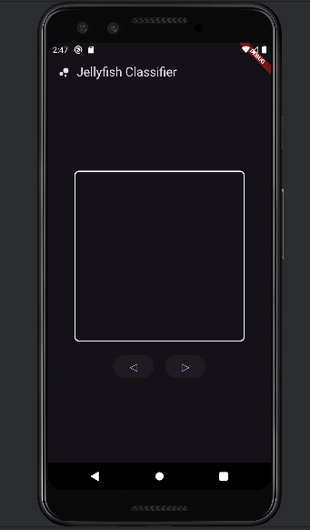
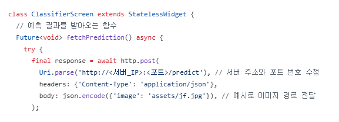
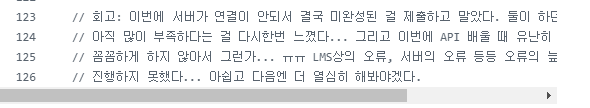
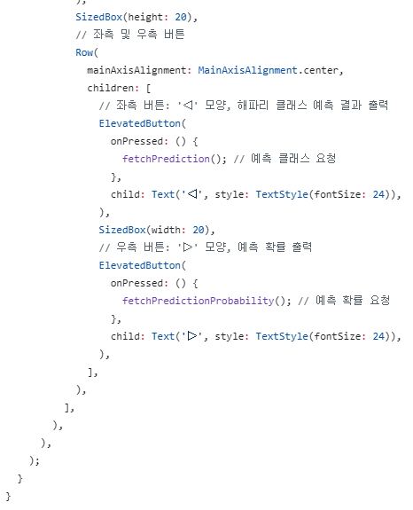

# AIFFEL Campus Online Code Peer Review Templete
- 코더 : 최유진
- 리뷰어 : 이은솔


# PRT(Peer Review Template)
- [ ]  **1. 주어진 문제를 해결하는 완성된 코드가 제출되었나요?**
    - 문제에서 요구하는 기능은 작동되지 않습니다.
    - 
    
- [x]  **2. 전체 코드에서 가장 핵심적이거나 가장 복잡하고 이해하기 어려운 부분에 작성된 
주석 또는 doc string을 보고 해당 코드가 잘 이해되었나요?**
    - 해당 코드가 무슨 기능을 하는지, 왜 그렇게 짜여진건지 잘 기술되어 있습니다.
    - 주석을 보고 이해가 잘 됩니다.
    - 
        
- [x]  **3. 에러가 난 부분을 디버깅하여 문제를 해결한 기록을 남겼거나
새로운 시도 또는 추가 실험을 수행해봤나요?**
    - 문제 원인 및 해결 과정을 기록하지는 않았으나, 리뷰 시 구두로 설명해주셨습니다.
        
- [x]  **4. 회고를 잘 작성했나요?**
    - 프로젝트 결과물에 대해 배운점과 아쉬운점, 느낀점 등이 상세히 기록 되어 있습니다.
    - 
        
- [x]  **5. 코드가 간결하고 효율적인가요?**
    - 코드 중복을 최소화하고 범용적으로 사용할 수 있도록 모듈화하였습니다.
    - 


# 회고(참고 링크 및 코드 개선)
```
다른 그루분들도 저와 비슷한 어려움을 겪었다는 점을 알게 되었습니다.
각자가 겪은 어려움의 구체적인 부분과 그것을 어떻게 해결했는지에 대한 의견을 나눌 수 있어 좋았습니다.
```
