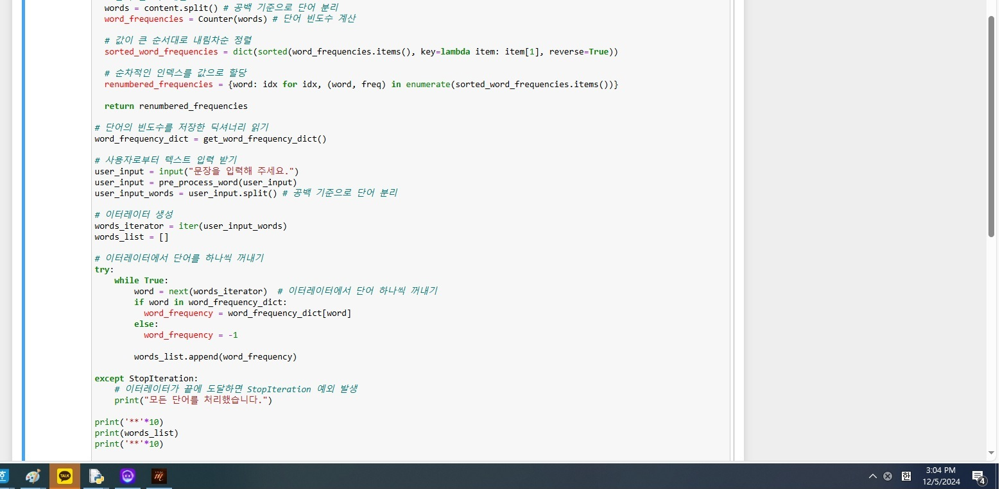

# AIFFEL Campus Online Code Peer Review Templete
- 코더 : 최유진
- 리뷰어 : 박종호


# PRT(Peer Review Template)
- [x]  **1. 주어진 문제를 해결하는 완성된 코드가 제출되었나요?**
    YES
    
- [x]  **2. 전체 코드에서 가장 핵심적이거나 가장 복잡하고 이해하기 어려운 부분에 작성된 
주석 또는 doc string을 보고 해당 코드가 잘 이해되었나요?**
    제가 코딩을 하면서 이터레이터로 count를 할 생각은 못했는데 너무 훌륭하게 하심
    Doc string은 없으나 주석이 잘 달려있어서 이게 뭐에 관한 코드인지 잘 이해가 갔다.
     
- [x]  **3. 에러가 난 부분을 디버깅하여 문제를 해결한 기록을 남겼거나
새로운 시도 또는 추가 실험을 수행해봤나요?**
     에러가 난 부분은 적지 않고 새로운 시도 또는 추가 실험은 말로써 설명을 들음
        
- [x]  **4. 회고를 잘 작성했나요?**
    회고가 잘 작성되었습니다. 아직 부족한 부분들이 많이 있다고 솔직하게 적어주셨습니다.
    권중님은 대단하십니다.
    
        
- [x]  **5. 코드가 간결하고 효율적인가요?**
    제가 실력이 부족해서 코드를 보고도 이해가 잘 안되는 부분이 있었지만 
    처리 과정을 정확하게 주석으로 명시하고 나누었고 특히 함수를 쓴부분이 효율적이라고 생각합니다.
    
    

# 회고(참고 링크 및 코드 개선)
```
# 코드를 보면서도 이해가 안가는 부분들이 많았습니다.... 
# 물론 이게 제 실력이 부족해서 이해를 못하는 부분이라..... 
```
