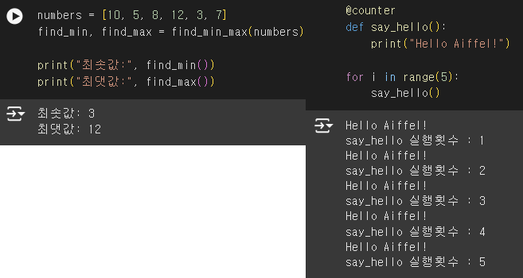
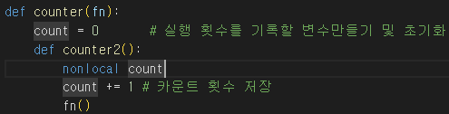
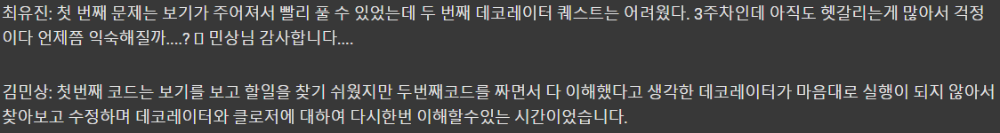

# AIFFEL Campus Online Code Peer Review Templete
- 코더 : 최유진
- 리뷰어 : 강민성


# PRT(Peer Review Template)
- [x]  **1. 주어진 문제를 해결하는 완성된 코드가 제출되었나요?**
    - 문제가 잘 해결된 완성된 코드였습니다.
    - 

- [x]  **2. 전체 코드에서 가장 핵심적이거나 가장 복잡하고 이해하기 어려운 부분에 작성된 
주석 또는 doc string을 보고 해당 코드가 잘 이해되었나요?**
    - 핵심적인 부분에 주석이 작성되어 있어 이해하기 한결 편했습니다.
    - 

- [x]  **3. 에러가 난 부분을 디버깅하여 문제를 해결한 기록을 남겼거나
새로운 시도 또는 추가 실험을 수행해봤나요?**
    - 에러가 났고, 디버깅한 기록이 남겨져 있어 어떠한 과정을 거쳐 코드를 작성하였는지 잘 알 수 있었습니다.
    -  
 
- [x]  **4. 회고를 잘 작성했나요?**
    - 회고가 잘 작성되어 있어 그루들의 고뇌를 알 수 있었습니다.
    - 
  
- [x]  **5. 코드가 간결하고 효율적인가요?**
    - 작성된 코드가 간결하여 설명을 듣지 않아도 이해할 수 있었습니다.

# 회고(참고 링크 및 코드 개선)
```
데코레이터는 역시 모든 분들이 어려워하는 것 같습니다. 저 포함해서요.
코드 설명을 들으면서 제 코드의 문제를 파악할 수 있었습니다. 감사합니다.
```
